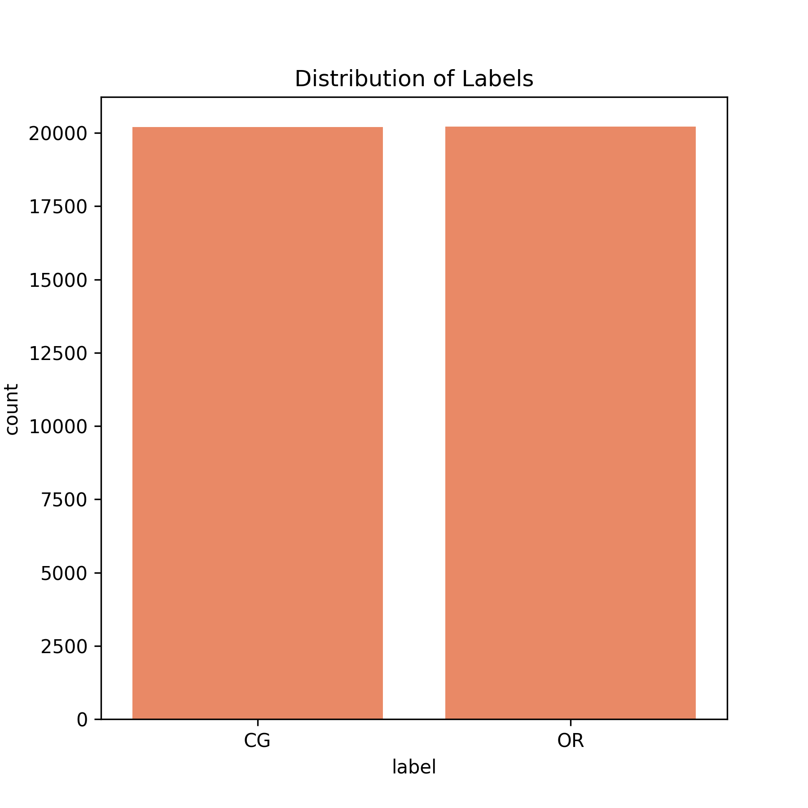
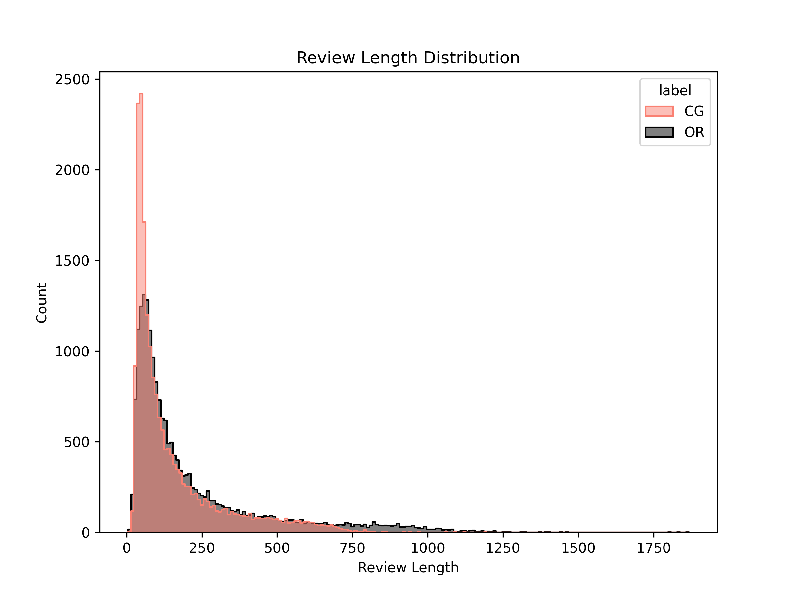
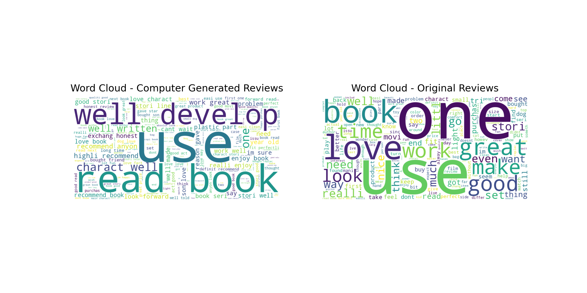

# Fake Review Detector
End-to-end text classification pipeline for identifying fake vs genuine reviews using TF-IDF, feature engineering, and multiple ML models.

---

## Overview

Online marketplaces and review platforms are vulnerable to **opinion spam**—fake or manipulated reviews that distort reputation and trust.  
This project applies natural language processing (NLP) and supervised machine learning to classify reviews as *real* or *fake*.

**Goal:** Build a transparent, reproducible baseline using CountVectorizer/TF-IDF features and common classifiers (Naive Bayes, Logistic Regression, SVM, Random Forest, LightGBM).

---

##  Dataset
The project uses the Fake Reviews dataset from Kaggle.
You can download it from:
https://www.kaggle.com/datasets/mexwell/fake-reviews-dataset

The dataset includes category, rating, text, and binary labels (CG or OR).

---

## Methodology

1. **Text Cleaning** – lowercase, remove punctuation & stopwords, lemmatization.
2. **Data Visualization** - explore review length distributions, word frequencies, and class balance through plots to understand dataset characteristics and potential biases. 
3. **Feature Extraction** – Bag-of-Words / TF-IDF.  
4. **Model Training** – Naive Bayes, Logistic Regression, SVC, Random Forest, and LightGBM.  
5. **Evaluation** – Accuracy, precision, recall, F1-score, and confusion matrix.  
6. **Selection** – Best model chosen by overall performance on the held-out set.

---

## Data Visualization

**1. Class Distribution**

Shows how balanced the dataset is between *Computer Generated (fake)* and *Original (genuine)* reviews.



**2. Review Length Distribution**

Displays how long typical reviews are. This helps detect unusually short or long reviews that might indicate automation or spam.



**3. Word Cloud**

Visual representation of the most frequent words across all reviews after preprocessing.  
It provides a quick and intuitive sense of the common terms used in the dataset.



---

## Results Summary

| Model | Accuracy |
|---|---|
| Multinomial Naive Bayes | 0.8485 |
| Random Forest | 0.8398 |
| SVC | 0.8851 |
| Logistic Regression | 0.8634 |
| LightGBM | 0.8375 |
| Enhanced Logistic Regression | 0.8727 |
| Enhanced SVC | 0.8679 |

**Confusion Matrix (Best Model – SVC)**

Visualizes how well the SVC classifier distinguishes between fake and genuine reviews.


*Note: The confusion matrix corresponds to a re-run of the SVC model (accuracy ≈ 88.2%), which may differ slightly from earlier runs due to random data splits.*

**Key Takeaways**
- Linear models (Logistic Regression, SVC) work best on TF-IDF text.  
- Random Forest and LightGBM can struggle with sparse, high-dimensional vectors.  
- Naive Bayes is a strong, fast baseline, but less flexible.  

---

## Requirements and Setup

To run the notebook, you’ll need **Python 3.7+** and the libraries listed below.  
You can install everything easily with:

```bash
pip install -r requirements.txt
```
### Required Libraries

- **pandas** → data loading and manipulation  
- **numpy** → numerical and matrix operations  
- **scikit-learn** → preprocessing, TF-IDF, model training (Naive Bayes, SVC, Logistic Regression, Random Forest)  
- **lightgbm** → gradient boosting model  
- **nltk** → text cleaning, tokenization, stopword removal, lemmatization  
- **matplotlib / seaborn** → visualizations and plots  
- **wordcloud** → generate frequency-based word cloud  
- **joblib** → save and load trained pipelines

---

## How to Run the Project

1. **Clone this repository**
   ```bash
   git clone https://github.com/Rohmaa-f/Fake-Review-Detector.git
   ```
2. **Navigate to the project directory**
   ```bash
   cd Fake-Review-Detector
   ```
3. **Install dependencies**
   ```bash
   pip install -r requirements.txt
   ```
4. **Open the Jupyter notebook**
    ```bash
   jupyter notebook Fake_Review_Detector.ipynb
   ```
5. **Run all cells sequentially**

---

## Saved Model

The final **SVC pipeline (best model)** (including preprocessing, TF-IDF, and classifier) is saved at:

`models/fake_review_svc_pipeline.pkl`

You can load and use it directly for predictions:

```python
import joblib

# Load the trained pipeline
model = joblib.load("models/fake_review_svc_pipeline.pkl")

# Example prediction
sample_review = ["This product was absolutely amazing!"]
print(model.predict(sample_review))
```
---
